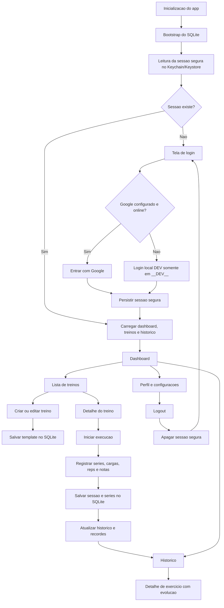

# LogGYM

Aplicativo React Native Android-first para registrar treinos de musculacao, cargas, repeticoes e anotacoes com fluxo offline-first, login Google e foco em usabilidade durante o treino.

## Stack

- React Native CLI `0.85.2`
- TypeScript `6.0.3`
- React Navigation `7`
- Zustand para estado global
- SQLite local com `react-native-nitro-sqlite`
- Keychain/Keystore com `react-native-keychain`
- Google Sign-In com `@react-native-google-signin/google-signin`
- Backup local com `@react-native-documents/picker` + `react-native-file-access`
- Validacao com `zod` + `react-hook-form`
- UI com `react-native-linear-gradient`, `react-native-svg` e `lucide-react-native`

## O que o app entrega

- Login com Google configuravel por `.env`
- Sessao persistida com Keychain/Keystore
- Fallback de login local apenas em `__DEV__`
- Templates de treino editaveis
- Registro de execucoes com series, carga, repeticoes e notas
- Historico local completo
- Evolucao de carga por exercicio
- Exportacao e importacao de backup local em JSON
- Seed inicial para facilitar testes
- Build Android debug validado com `.apk`

## Estrutura principal

```text
src/
  app/
  components/
  features/
    auth/
    workouts/
  navigation/
  screens/
  storage/
  store/
  theme/
  types/
  utils/
android/
.env.example
```

## Pre-requisitos

- Node `>= 22.11`
- npm `>= 11`
- JDK `17`
- Android Studio com SDK `36`
- ADB no PATH

## Instalar dependencias

```bash
npm install
```

## Variaveis de ambiente

O projeto inclui:

- `.env.example` para referencia
- `.env` local com placeholders seguros para DEV

Variaveis esperadas:

```env
LOGGYM_GOOGLE_WEB_CLIENT_ID=your-web-client-id.apps.googleusercontent.com
LOGGYM_GOOGLE_IOS_CLIENT_ID=your-ios-client-id.apps.googleusercontent.com
LOGGYM_ENABLE_DEV_LOGIN=true
```

Importante:

- Nao coloque secrets reais sensiveis no `.env`
- O app usa `.env` apenas para IDs publicos de configuracao
- No fluxo Android atual, `LOGGYM_GOOGLE_WEB_CLIENT_ID` e opcional
- Credenciais de assinatura Android devem ficar em `~/.gradle/gradle.properties` ou ambiente local, nao no repositorio

## Configurar Google Sign-In no Android

1. Abra o Google Cloud Console.
2. Acesse `APIs & Services` -> `Credentials`.
3. Crie um OAuth Client do tipo `Android`.
4. Use o package name `com.loggym`.
5. Cadastre o SHA-1 da debug keystore.

Comando para obter o SHA-1 da debug keystore no Windows:

```powershell
keytool -list -v -alias androiddebugkey -keystore "$env:USERPROFILE\.android\debug.keystore" -storepass android -keypass android
```

6. Crie tambem um OAuth Client do tipo `Web`.
7. Copie o client ID Web para `LOGGYM_GOOGLE_WEB_CLIENT_ID` apenas se depois voce quiser `idToken` ou `offlineAccess`.
8. Se for usar iOS futuramente, preencha `LOGGYM_GOOGLE_IOS_CLIENT_ID`.
9. Quando for testar a APK release assinada, adicione tambem o SHA-1 da keystore release no Google Cloud Console.

Observacao:

- O login Google real depende dessa configuracao
- Para este MVP Android, o cliente OAuth `Android` com package name + SHA-1 correto e a parte obrigatoria
- Em release, o SHA-1 muda. Se ele nao estiver cadastrado no client OAuth Android, o login Google da APK release falha com `DEVELOPER_ERROR`
- Se voce informar `webClientId`, ele precisa ser um client ID do tipo `Web`; um valor incorreto tambem pode causar erro de configuracao
- `google-services.json` nao e necessario para este fluxo atual, a menos que voce integre Firebase Auth
- Em ambiente de desenvolvimento, o app tambem oferece login local controlado por `LOGGYM_ENABLE_DEV_LOGIN=true`
- O login local e apenas para teste e nao aparece como solucao de producao

Comando util para obter o SHA-1 da keystore release local:

```powershell
keytool -list -v -keystore ".\android\keystores\loggym-upload.jks" -alias loggym-upload
```

## Rodar em DEV no Android

Terminal 1:

```bash
npm start
```

Terminal 2:

```bash
npm run android:dev
```

Se preferir resetar o Metro:

```bash
npm run start:reset
```

## Gerar APK debug para teste

```bash
npm run apk:debug
```

APK gerado em:

```text
android/app/build/outputs/apk/debug/app-debug.apk
```

## APK release assinado

O build release agora falha de forma segura se a assinatura real nao estiver configurada. Nao existe mais fallback para debug keystore no `assembleRelease`.

1. Gere sua keystore de release:

```powershell
keytool -genkeypair -v -storetype PKCS12 -keystore ".\android\keystores\loggym-upload.jks" -alias loggym-upload -keyalg RSA -keysize 2048 -validity 9125
```

2. Use o modelo [`android/release-signing.example.properties`](android/release-signing.example.properties) como base e adicione as chaves `LOGGYM_*` em `%USERPROFILE%\.gradle\gradle.properties` com valores reais:

```properties
LOGGYM_UPLOAD_STORE_FILE=../keystores/loggym-upload.jks
LOGGYM_UPLOAD_STORE_PASSWORD=your_store_password
LOGGYM_UPLOAD_KEY_ALIAS=your_key_alias
LOGGYM_UPLOAD_KEY_PASSWORD=your_key_password
```

3. Valide a configuracao:

```bash
npm run release:check
```

4. Gere a APK release assinada:

```bash
npm run apk:release
```

APK gerada em:

```text
android/app/build/outputs/apk/release/app-release.apk
```

Notas:

- guarde passwords e keystore fora do repositorio
- `LOGGYM_UPLOAD_*` pode vir de `~/.gradle/gradle.properties` ou de variaveis de ambiente
- o script `release:check` valida keystore, alias e JDK antes do build
- o build release publica com `usesCleartextTraffic=false`, Proguard e shrink de resources

## Backup local manual

O app agora permite:

- exportar um backup JSON do usuario autenticado
- importar esse backup no mesmo email/provedor autenticado
- restaurar treinos, exercicios, sessoes e series sem depender de backend

Regras de seguranca do backup:

- o arquivo importado passa por validacao estrutural com `zod`
- backups maiores que 5 MB sao bloqueados
- a restauracao recusa backup de outra conta
- o arquivo temporario em cache e apagado apos exportar/importar

## Scripts uteis

```bash
npm run verify
npm run lint
npm run lint:fix
npm run typecheck
npm run release:check
npm run apk:debug
npm run apk:release
```

## Modelo de dados

SQLite local com as tabelas:

- `users`
- `metadata`
- `workouts`
- `workout_exercises`
- `workout_sessions`
- `session_sets`

O historico guarda snapshots de nome de treino e exercicio para preservar os registros mesmo que o template seja alterado ou removido.

## Seguranca aplicada

- Sessao salva com `react-native-keychain`
- Sem AsyncStorage para informacao sensivel
- Sem persistencia de tokens Google em texto puro
- Queries SQLite parametrizadas
- `.env` separado de variaveis de assinatura
- `allowBackup=false` no AndroidManifest
- `usesCleartextTraffic=true` apenas no build debug e `false` no release
- Proguard habilitado no release
- `assembleRelease` bloqueado sem keystore real configurada
- `build_config_package` protegido no Proguard para `react-native-config`
- Telas autenticadas protegidas pela raiz de navegacao
- Login de desenvolvimento restrito a `__DEV__`
- Backup validado, limitado por tamanho e restrito a mesma conta autenticada

## Riscos residuais

- O login Google depende da configuracao correta de OAuth no Google Cloud
- O build release ainda depende da guarda segura da keystore e das passwords fora do repositorio
- Algumas dependencias Android exibem warnings de APIs deprecated do ecossistema, mas o build debug validado passou
- O fluxo offline atual e local-only; sincronizacao com backend ficou preparada apenas estruturalmente
- O backup e manual; ainda nao existe sincronizacao automatica ou criptografia ponta a ponta para exportacao

## Fluxo do app



Resumo do fluxo:

- o app inicia, carrega SQLite e tenta restaurar a sessao segura
- sem sessao, cai no login
- com sessao, abre dashboard e carrega dados locais
- templates alimentam a execucao de treino
- cada execucao salva historico e progresso por exercicio
- logout limpa apenas a sessao, mantendo os dados locais da conta ja registrada

## Validacao executada neste workspace

- `npm run typecheck`
- `npm run lint`
- `npm run verify`
- `npm run apk:debug`

APK debug validado em:

```text
android/app/build/outputs/apk/debug/app-debug.apk
```
