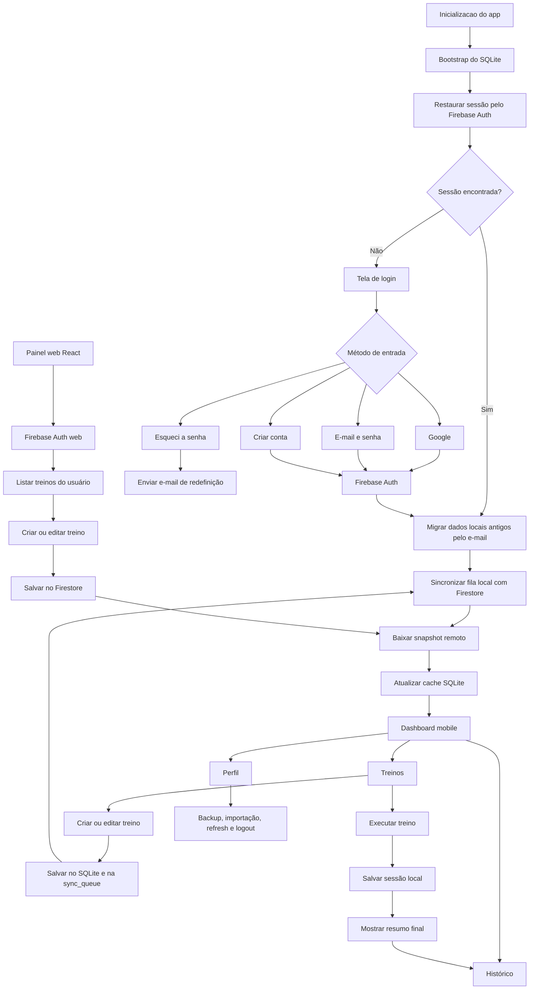

# LogGYM

LogGYM agora funciona como um produto de duas frentes no mesmo repositório:

- app mobile React Native para registrar treinos offline no Android
- painel web React para cadastrar e editar treinos por usuário
- Firebase Auth + Firestore para compartilhar identidade e sincronização
- SQLite local no app como cache offline-first

## Stack principal

- React Native CLI `0.85.2`
- TypeScript `6.0.3`
- React Navigation `7`
- Zustand para estado global
- SQLite local com `react-native-nitro-sqlite`
- Firebase Auth no mobile com `@react-native-firebase/auth`
- Firestore no mobile com `@react-native-firebase/firestore`
- Google Sign-In mobile com `@react-native-google-signin/google-signin`
- React web com Vite `8`
- Firebase Web SDK `12.12.1`
- Validação com `zod` + `react-hook-form`

## O que o projeto entrega

- login compartilhado com Google ou e-mail/senha
- sincronização por usuário entre painel web e app
- cache local SQLite no app para continuar usando sem internet
- fila de sincronização local para não perder alterações feitas offline
- backup manual e importação externa de treinos continuam disponíveis no app
- regras do Firestore no repositório
- painel web real para criar, editar e excluir treinos

## Estrutura principal

```text
android/
docs/
scripts/
src/
  app/
  components/
  features/
    auth/
    firebase/
    sync/
    workouts/
  navigation/
  screens/
  storage/
  store/
  theme/
  types/
  utils/
web/
firebase.json
firestore.rules
firestore.indexes.json
.env.example
web/.env.example
```

## Pré-requisitos

- Node `>= 22.11`
- npm `>= 11`
- JDK `17`
- Android Studio com SDK `36`
- projeto Firebase criado

## Instalação

```bash
npm install
```

O painel web usa o próprio `package.json` em `web/`, mas os comandos da raiz já chamam o prefixo correto.

## Variáveis de ambiente

Mobile: use `.env.example` como base para `.env`.

Web: use `web/.env.example` como base para `web/.env`.

Mobile:

```env
LOGGYM_GOOGLE_WEB_CLIENT_ID=your-web-client-id.apps.googleusercontent.com
LOGGYM_GOOGLE_IOS_CLIENT_ID=your-ios-client-id.apps.googleusercontent.com
LOGGYM_ENABLE_DEV_LOGIN=false
LOGGYM_FIREBASE_USE_EMULATORS=false
LOGGYM_FIREBASE_AUTH_EMULATOR_HOST=10.0.2.2:9099
LOGGYM_FIREBASE_FIRESTORE_EMULATOR_HOST=10.0.2.2:8080
```

Web:

```env
VITE_FIREBASE_API_KEY=your-firebase-web-api-key
VITE_FIREBASE_AUTH_DOMAIN=your-project-id.firebaseapp.com
VITE_FIREBASE_PROJECT_ID=your-project-id
VITE_FIREBASE_STORAGE_BUCKET=your-project-id.appspot.com
VITE_FIREBASE_MESSAGING_SENDER_ID=1234567890
VITE_FIREBASE_APP_ID=1:1234567890:web:abcdef123456
VITE_FIREBASE_MEASUREMENT_ID=G-XXXXXXXXXX
```

## Setup Firebase

O passo a passo completo está em [docs/firebase-setup.md](docs/firebase-setup.md).

Resumo do obrigatório:

1. criar o projeto Firebase
2. habilitar `Google` e `Email/Password` no Auth
3. adicionar o app Android `com.loggym`
4. baixar `android/app/google-services.json`
5. cadastrar SHA-1 e SHA-256 debug/release
6. adicionar o app Web e preencher `web/.env`
7. publicar `firestore.rules` e `firestore.indexes.json`
8. autorizar `localhost` no Firebase Auth para usar o painel web em DEV

## Doctor

```bash
npm run firebase:doctor
```

O doctor atual válida:

- `firebase.json`
- `firestore.rules`
- `.env`
- `web/.env`
- `android/app/google-services.json`

## Rodar em DEV

### App mobile

Terminal 1:

```bash
npm run start
```

Terminal 2:

```bash
npm run android:dev
```

### Painel web

```bash
npm run web:dev
```

## Build

### Web

```bash
npm run web:build
```

### APK debug

```bash
npm run apk:debug
```

### APK release

```bash
npm run release:check
npm run apk:release
```

Observação:

- o Android agora exige `android/app/google-services.json`
- sem esse arquivo, o Gradle bloqueia o build porque o Firebase Auth e o Firestore nativos não podem ser inicializados de forma segura

## Fluxos principais

### Mobile

- restaura a sessão do Firebase Auth
- migra dados locais do usuário antigo pelo e-mail, quando existir
- usa SQLite para leitura rápida e funcionamento offline
- envia alterações pendentes para o Firestore quando a internet volta
- baixa o snapshot remoto e atualiza o cache local

### Web

- autentica com a mesma conta Firebase do app
- lista treinos em tempo real por usuário
- cria, edita e exclui templates no Firestore
- o app passa a receber essas mudanças na próxima sincronização

### Perfil do app

- backup manual JSON
- restauração do backup da mesma conta
- importação de `.txt`, `.csv`, `.xls` e `.xlsx`
- atualização manual dos dados
- logout

## Modelo de dados

### Local no app

- `users`
- `metadata`
- `workouts`
- `workout_exercises`
- `workout_sessions`
- `session_sets`
- `sync_queue`

### Cloud no Firestore

- `users/{uid}`
- `users/{uid}/workouts/{workoutId}`
- `users/{uid}/sessions/{sessionId}`

## Segurança aplicada

- Firebase Auth para identidade compartilhada
- regras do Firestore com escopo por `request.auth.uid`
- sem AsyncStorage para sessão sensível
- `google-services.json` e `web/.env` fora do Git
- queries SQLite parametrizadas
- tela autenticada protegida pela raiz de navegação
- fila local de sincronização para não depender da rede no momento do registro
- válidação estrutural dos documentos remotos antes de gravar no SQLite
- release Android continua exigindo keystore fora do repositório

## Riscos residuais

- o app Android ainda não pode ser compilado neste workspace sem um `google-services.json` real
- o painel web depende de `web/.env` com as chaves do app Web do Firebase
- a build web está funcional, mas o bundle ficou acima do aviso padrão de 500 kB do Vite
- a sincronização atual é “pull no bootstrap/refresh e push por fila”; não há listener em tempo real no app mobile
- regras do Firestore precisam ser publicadas antes de usar contas reais

## Fluxograma atualizado



Resumo curto:

- o login do app e do site agora é o mesmo
- o site grava treinos direto no Firestore por usuário
- o app continua usando SQLite para velocidade e offline
- a fila `sync_queue` garante que edições offline do mobile possam subir depois
- o snapshot remoto vira a base de sincronização do cache local

## Validação executada neste workspace

- `npm run typecheck`
- `npm run lint`
- `npm run web:lint`
- `npm run web:build`
- `npm run firebase:doctor`

Status atual do doctor neste workspace:

- `web/.env` ainda ausente
- `android/app/google-services.json` ainda ausente

Esses dois itens são o bloqueio real para testar a conta Firebase de ponta a ponta aqui.
